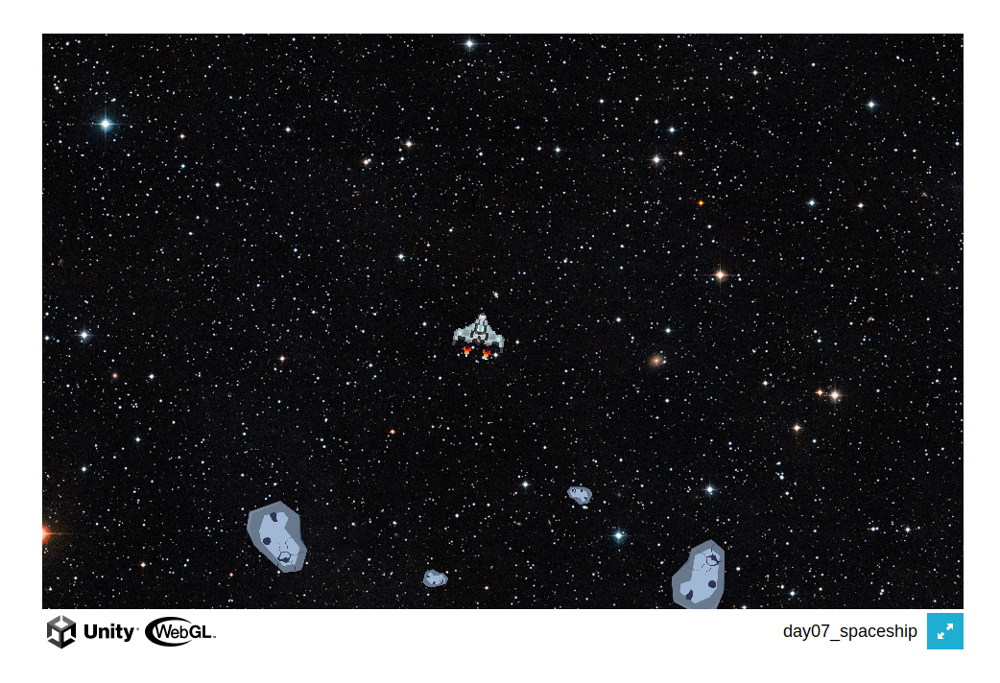

Hack-A-Day is a project I'm doing in November, where I try to make 30 new projects, in 30 days.

# Day 06: Hack-An-Asteroid

This is an asteroid clone. There are 4 levels of increasing difficulty.

Controls: Mouse to aim, W or up-arrow to accelerate, left click to shoot.

Demo available at [here](https://tilde.za3k.com/hackaday/icecube).

Source not available for this one, sorry. Unity projects are hard to move and I couldn't figure it out.

### Credits

### Music
Background music - "Artemis" by Scott Buckley with permission (CC-BY 4.0), https://www.scottbuckley.com.au/
Misc sound effects - Generated by https://sfxr.me/.
Victory music - From Zelda (without permission)

### Sprites
Spaceship - https://www.nicepng.com/ourpic/u2q8a9y3a9r5i1r5_vector-spaces-ship-8-bit-spaceship-sprite/
Asteroid - https://www.ggdesign.me/products/asteroids GGDesign with permission (CC-ND 4.0)
